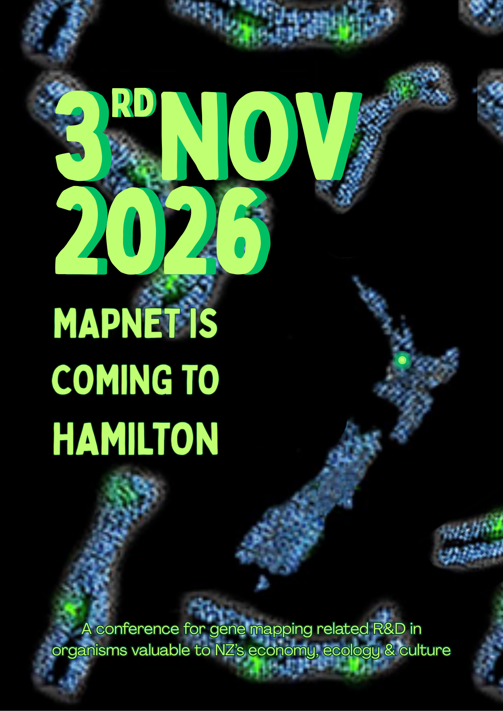

<!--
header:
    overlay_image: "/assets/2026/banner.png"
    overlay_filter: "0"
    cta_label: False
    cta_url: False
---
-->

# Welcome to the 2026 MapNet meeting
MapNet2026 will be held on the LIC (Livestock Improvement Corporation) campus in Newstead Hamilton, 3rd - 4th November 2026.

The conference themes, program and other information will be updated closer to the meeting date and posted here.

## Registrations opening in June 2026

<!--
- Professor Elinor Karlsson: Director, Vertebrate Genomics, Broad Institute of MIT and Harvard.
    - _The Future of Comparative Genomics: Finding Meaning in DNA Sequence in a Million Genome Age_

- Professor Alison Van Eenennaam: Animal Genomics and Biotechnology, University of California, Davis.
    - _Global Status of Gene Edited Food Animals and their Products_
  
- Associate Professor Vinzent Börner: GHPC Consulting and Services Pty Ltd, Australia.
    - _Past, present and future of high performance computing in animal breeding_
 
- Dr Suzanne Rowe: Senior Scientist, Animal Genomics, AgResearch, Invermay.
    - _Using molecular phenotypes to lower global methane emissions_
-->

<!-- [**Click here for the conference programme**]()  (https://vuwgenomics.github.io/mapnet2019.github.io/pdfs/MapNet2019programme.pdf). -->

 <!-- **[Click here to register]**()(https://vuw.eventsair.com/mapnet-2019/mapnet2019). -->

<!--## Sponsors 2023

#{:target="_blank"}

#

#{:target="_blank"}

#

#[.jpg)](https://www.agresearch.co.nz/partnering-with-us/products-and-services/genomnz/){:target="_blank"}

#

#{:target="_blank"}

#

{:target="_blank"}

{:target="_blank"}

<!--#{:target="_blank"}

#

#{:target="_blank"}

#

#{:target="_blank"}
#
-->

<!--  -->
   
<!--  -->
