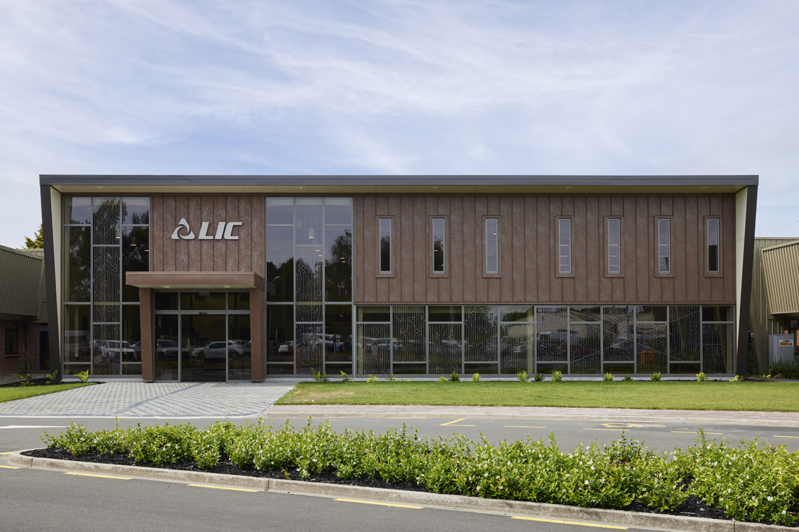

## Key dates

| Registrations opening | June 2026 |
| MapNet Meeting | 03-04 November, 2026 |
| Workshop / Excursion | 05 November 2026 |

<!--
| Deadline for abstract submission | 14 October, 2023 |
| Registration closes | 21 October, 2023 |
| MapNet | 22-24 November, 2023 | 
|        | Start time: 1:00pm (22/11/23) | 
|        | Finish time: 3:00pm (24/11/23) |
-->

## Location

MapNet 2026 is being held in the [Tempero Center, LIC (Livestock Improvement Corporation)](https://maps.app.goo.gl/kDXq9xjbcBQDU2vN8), Newstead, Hamilton.

## Social Media

<!--
If you are using X (a.k.a. the social media platform formerly known as Twitter), tag your conference posts #mapn25
-->

Please respect the requests of speakers and conference attendees that ask or suggest not to be included in social media posts.

<!-- ## Travel -->

<!-- Wellington airport (WLG) is about 9 km to Victoria University. Taxis from the airport cost $40+ and take half an hour or so. There are also shared shuttle services which can drop you in the centre of town or at your accommodation for about $18–25, and take around an hour. The airport bus will take you to the center city, where you can transfer to a bus to VUW. -->

<!-- ## Accommodation -->

<!-- The best low cost and convenient accomodation option for MapNet 2019 is [Te Puni Village](https://www.mystudentvillage.com/nz/short-stays-newzealand/te-puni-village). Click on "Book now". Use the code MapNet2019 in the promo field after selecting the dates for your stay.-->

## Conference organising committee:

- Chad Harland
- Emma Voss
- Fenella Deans
- Hannah Trebes
- Laura Duntsch
- Natalie Graham
- Steffi Fritsche
- Thomas Lopdell

