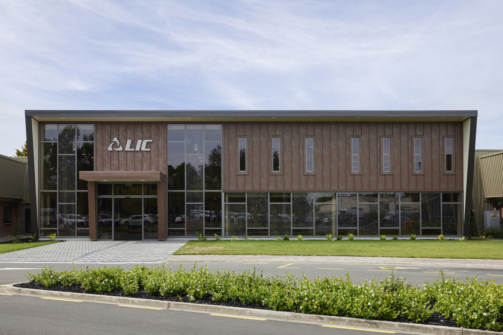
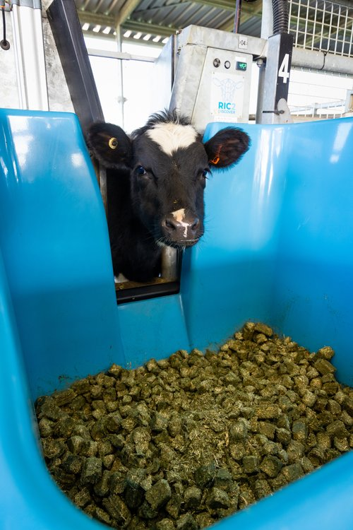

## Key dates

| Registrations opening | July 2026 |
| MapNet Meeting | 03-04 November, 2026 |
| Conference Dinner | 03 November, 2026 |
| Workshop / Excursion | 05 November 2026 |

### Conference

MapNet 2026 is being held in the [Tempero Center, LIC (Livestock Improvement Corporation)](https://maps.app.goo.gl/kDXq9xjbcBQDU2vN8), Newstead, Hamilton.

### Dinner

The Conference dinner this year will be held at [Zenders](https://zenders.nz/), which is 2km from LIC. This is a 2 minute drive from the conference site. You will be able to elect to join us for the dinner and inform us of any dietary requirements when purchasing your conference ticket.

### Workshop

REANNZ and Genomics Aotearoa have come together to run a one day workshop on [RNA-Seq Data Analysis](https://genomicsaotearoa.github.io/RNA-seq-workshop/). This will begin at approximately 8:30am. This event is catered.

### Farm Tour

LIC is offering the opportunity to tour their working dairy farm 'Innovation Farm'. This tour will be led by the farm manager and one of LIC's scientists and will include the purpose-built methane research barn, the milking shed, getting up close with the cows, and more. Transport to and from the farm will be provided from the conference venue at LIC. This event is catered.

