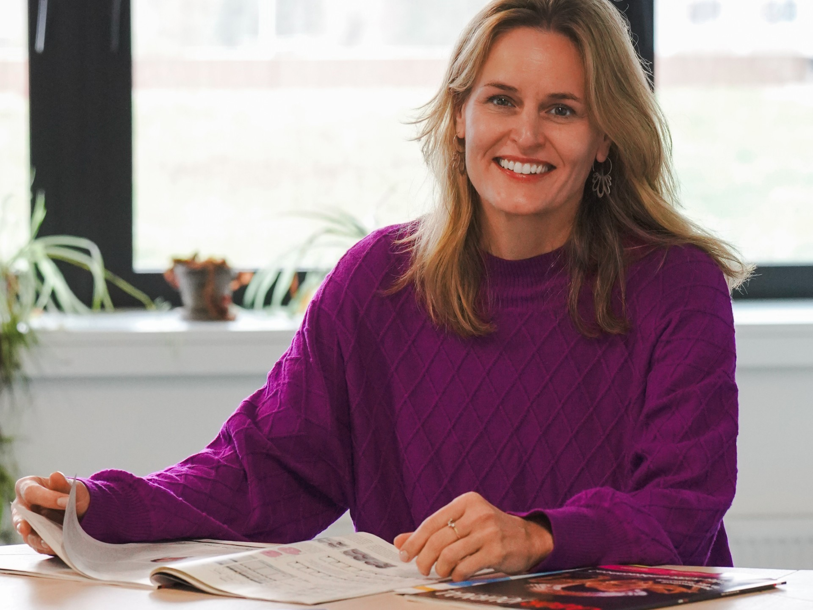
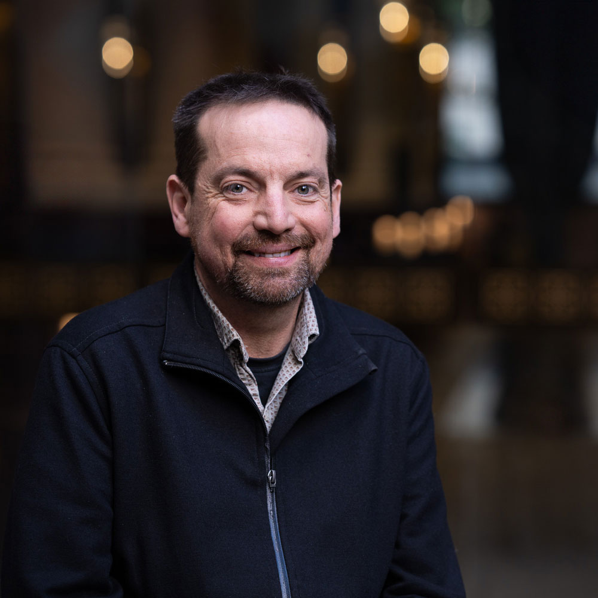

# Keynote Speakers

  

    <h2>Dr Maren Wellenreuther</h2>
      

        
      

      

        
Bioeconomy Science Institute

        
Science Group Leader, Seafood Production

        
University of Auckland

        
Professor

        

          Maren Wellenreuther is a full Professor at the School of Biological Sciences at the University of Auckland and Science Group Leader at the Bioeconomy Science Institute in New Zealand. She is internationally recognised for her leadership in evolutionary biology, fisheries genomics, and aquaculture research, with a strong focus on linking ecological and genomic processes to sustainable resource use. She has authored over 130 peer-reviewed publications and led numerous large-scale national and international research programmes at the interface of ecology, genomics, and applied marine science.

Her research career spans Germany, Australia, New Zealand, and Sweden, where she has built and led interdisciplinary teams, secured major competitive funding, and developed innovative approaches to studying adaptation in natural populations. She currently serves as Editor-in-Chief of Evolutionary Applications, shaping the direction and visibility of one of the field’s leading journals.

Her contributions have been recognised through several international honours, including the Petersen Professorship of Excellence (Germany, 2026), the Royal Society Te Apārangi Early Career Research Excellence Award (New Zealand, 2018), and the KVA King Carl XVI Gustaf’s 50-year Scholarship for the Promotion and Contribution to the Knowledge and Preservation of Biological Diversity (Sweden, 2013). As a Humboldt Fellow (Germany, 2024), she is committed to advancing next-generation genomic and experimental tools to improve the sustainability, resilience, and productivity of aquatic ecosystems and seafood production systems. She leads a dynamic research group of over 30 scientists plus students working across a diverse range of projects in fundamental research investigating epigenomic adaptation, structural variation, and climate resilience, alongside more applied work in aquaculture and fisheries science.

_Information provided by Dr Wellenreuther_

        

    

  

  

    <h2>Dr Ben Hayes</h2>
      

        
      

      

        
The University of Queensland

        
Professor

        
Queensland Alliance for Agriculture and Food Innovation

        
Professorial Research Fellow

        

         Professor Hayes has extensive research experience in genetic improvement of livestock, crop, pasture and aquaculture species, with a focus on integration of genomic information into breeding programs, including leading many large scale projects which have successfully implemented genomic technologies in livestock and cropping industries. Author of more than 300 journal papers, including in Nature Genetics, Nature Reviews Genetics, and Science, contributing to statistical methodology for genomic, microbiome and metagenomic profile predictions, quantitative genetics including knowledge of genetic mechanisms underlying complex traits, and development of bioinformatics pipelines for sequence analysis. Thomson Reuters highly cited researcher in 2015, 2016, 2017 and 2018.

_Information sourced from [The University of Queensland](https://about.uq.edu.au/experts/14352)_
        

    

  

# Invited Speakers

  

    <h2>Dr Alex Garton</h2>
      

        
      

      

        
The University of Auckland

        
Postdoctoral fellow

        

         Alexandra Garton is a postdoctoral fellow at the University of Auckland. She completed her PhD in 2025, where her research focused on applying multi-omics approaches, including single-nucleus RNA sequencing and spatial transcriptomics, to characterise the cellular and molecular organisation of the human olfactory bulb, a brain region affected early in Parkinson’s disease. Her doctoral work generated the first transcriptomic atlas of the human olfactory bulb and established a foundation for spatially resolving these newly described cell populations.

More recently, her research has focused on optimising the imaging-based spatial transcriptomics platform CosMx alongside analysing sequencing-based spatial transcriptomic data generated using Visium HD. She is also working on integrating spatial proteomic approaches including immunohistochemistry and mass spectrometry imaging to better understand disease-associated cell states in the olfactory bulb in Parkinson’s disease.

_Information provided by Dr Garton_
        

    

  

